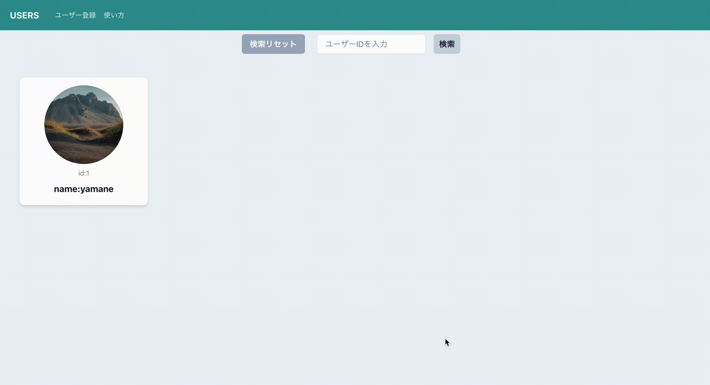
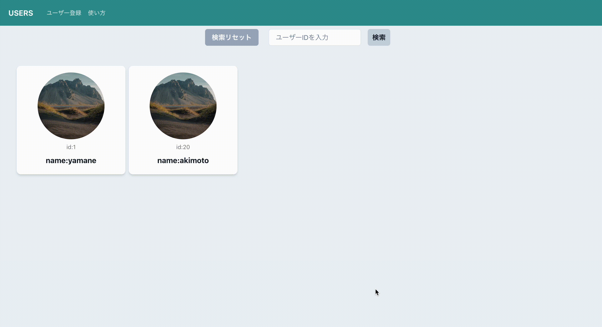

# User API

## 1.概要

ユーザー管理を行うAPIです。

* ユーザ情報の取得、登録、更新、削除
* JUnitによるテストコードの実装
* CIの実装
    * Checkstyle
    * Discordへ結果通知
* React,typescript によるフロントエンドの実装

### ユーザー登録

 

### ユーザー検索(id)

 

### ユーザー編集

 

### ユーザー削除

 

### アプリケーション概略図

## 2.使用技術

* Java 17.0.6
* Spring Boot 3.0.6
* O/R Mapper
    * MyBatis 3.0.0
* Docker
    * MySQL 8.0.33
* React 18.2.0
    * typescript 18.2.22
    * chakra-ui 2.8.1

## 3.起動手順

* リポジトリをgit cloneします  
  `git clone https://github.com/ryo-mk/USERAPI`
* Dockerを起動し、ターミナルで以下のコマンドを実行します。  
  `docker compose up`
* `src/main/java/com/example/users`配下にある
  `UsersApplication.java`クラスを実行します。
* Postmanを起動し、実行したい操作に応じてHTTPメソッドの選択、URLの入力、
  リクエストボディの入力を行います。

* userfrontendディレクトリに移動する。  
  `cd userfrontend/`

* 依存関係をインストールし、Reactのアプリケーションを起動する。  
  `npm install`
  `npm start`

## 4.API仕様書

SwaggerによるAPI仕様書(作成中)

## 5.AWSへのデプロイ

今後の展望に記載

## 6.学習による気づき・苦労した点など

* エラーが出まくる・エラー内容がわからない

  初学時につまずいた点としては「実装がうまくいかない」、つまりエラーがよくわからないといったことでした。
  学習初めの時にはエラー文で検索をしても「書いてある内容がわからない」「圧倒的な知識不足」を非常に痛感しました。
  検索した内容でさらにキーワードを検索、参考書による基礎技術の習得を経てエラーに対する対応力を培うことができました。
  また、途中からはChatGPTを利用することもできるようになりました。

* JUnitの体系的な情報を得るのが難しい

  Javaや、Springについては参考書や、技術サイトなどでも比較的情報が揃っていたので調べると欲しい内容が出てきました。
  しかし、テスト実装をするにあたって、参考書もJUnit5については見当たらず、サイトなどでもなかなか情報が出て来ないので苦労しました。
  前述したChatGPTなども駆使しつつ、テストコードを実装しました。

## 7.今後の展望

* AWSへのデプロイ
* 実装機能の拡張、追加
    * name以外の項目の追加
    * ユーザーの所属テーブルの追加など
* Java関連資格の取得

## 8.実装内容

結合テストの実装

* DELETE

| パス          | ステータスコード | テスト内容                                |
|-------------|----------|--------------------------------------|
| /users/{id} | 200      | ユーザーが削除できること                         |
| /users/99   | 404      | 削除時に指定したidのユーザーが存在しない場合ステータス404を返すこと |

* PATCH

| パス          | ステータスコード | テスト内容                                |
|-------------|----------|--------------------------------------|
| /users/{id} | 200      | 指定したidのユーザーを更新できること                  |
| /users/{id} | 400      | 更新時のnameがnullか空の場合更新に失敗すること          |
| /users/99   | 404      | 更新時に指定したidのユーザーが存在しない場合ステータス404を返すこと |

* POST

| パス     | ステータスコード | テスト内容                       |
|--------|----------|-----------------------------|
| /users | 201      | ユーザーを登録できること                |
| /users | 400      | 登録時のnameがnullか空の場合登録に失敗すること |

* GET

| パス          | ステータスコード | テスト内容                      |
|-------------|----------|----------------------------|
| /users      | 200      | 全ユーザーの情報を取得できること           |
| /users      | 200      | DBが空の時、空のリストを返すこと          |
| /users/{id} | 200      | 指定したidのユーザーの情報を取得できること     |
| /users/{id} | 404      | 指定したidが存在しない場合、例外がスローされること |

***

Mapperの単体テスト実装

## Read処理の単体テストの実装

* 全ユーザーの情報を取得できること
* ユーザーが存在しないときは空のリストを返すこと
* 指定したidのユーザーが取得できること
* 指定したidのユーザーが存在しない時空のOptionalを返すこと

## Create処理の単体テストの実装

* ユーザーが登録できる且つ既存のidより大きい数字のidが採番されること

## Update処理の単体テストの実装

* 存在するidユーザーが更新できること

## Delete処理の単体テストの実装

* ユーザーを削除できること

***

Serviceの単体テスト実装

## Read処理の単体テストの実装

* 全ユーザーの情報を取得できること
* 指定したidのユーザーの情報を取得できること
* 指定したidが存在しない場合、例外がスローされること

## Create処理の単体テストの実装

* ユーザーの登録ができること

## Update処理の単体テストの実装

* 存在するidユーザーが更新できること
* 更新対象のidが存在しない時に例外がスローされること

## Delete処理の単体テストの実装

* 存在するidユーザーが削除できること
* 削除対象のidが存在しない時に例外がスローされること

***

CRUD処理の実装

## Readの実装(GET)

1./users で全ユーザーのidとnameを取得する  
2./users/id で指定したidに該当するユーザーのidとnameを取得する  
3.(2)で指定したidのユーザーが存在しない場合、404エラーを返す

## Createの実装(POST)

1./users で任意のユーザーを新規登録する

* idは順に自動割当てされる
* ユーザーの名前は20文字以下とする
* 登録時に空白、Nullは認めない

## Updateの実装(PATCH)

1./users/id で指定したidのユーザー名を変更する
2.指定したidのユーザーが存在しない場合、404エラーを返す

* 更新ユーザーの名前は20文字以下とする
* 更新時に名前の空白、Nullは認めない

## Deleteの実装(Delete)

1./users/id で指定したidのユーザーを削除する
2.指定したidのユーザーが存在しない場合、404エラーを返す

***

フロントエンドの実装

## 全てのユーザーをDBから取得し、表示

* 初期画面で、全てのユーザーを取得し表示する機能を実装
* 任意のユーザーカードを選択すると、そのユーザーの詳細情報をモーダル表示する

## id検索機能を実装

* 指定したidを入力し、検索ボタンを押すと特定のidのユーザーのみを表示する機能を実装
* リセットボタンで検索を中止し、全てのユーザーを表示する

## ユーザー登録の実装

* ユーザー登録画面で、名前を入力し登録ボタンを押すとユーザー登録を行う
* 成功時は成功のポップアップを表示し、失敗時には失敗しましたの表示を行う

## ユーザー編集機能の実装

* ユーザーカード内で名前を変更し、更新ボタンを押すとユーザー名を変更する
* 変更後は成功、失敗のポップアップを表示し、モーダルを閉じる。

